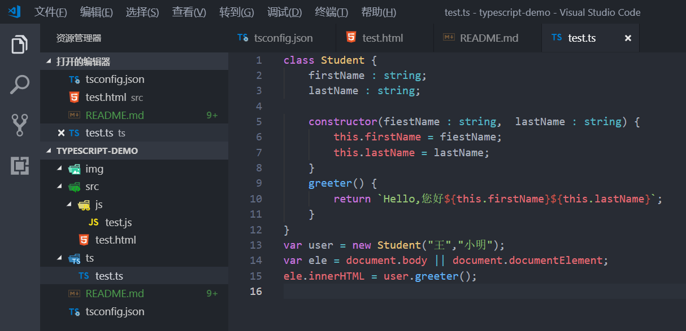

# TypeScript

>TypeScript 学习demo

## 什么是TypeScript？

>TypeScript是一种由微软开发的自由和开源的编程语言，它是JavaScript的一个超集，扩展了JavaScript的语法。

## TypeScript的特性

```

1、字符串变量的反撇号 ``
2、参数类型声明
3、函数参数
4、generator函数
5、析构函数
6、箭头表达式、
7、循环
8、class、泛型
9、接口
10、 类型定义文件（*.d.ts）

```
## VScode 自动编译TypeScript的方式
 
### 1、进入nodejs里安装typescript

```
npm install -g typescript
```
### 2、创建tsconfig.json文件

```
tsc --init
```
### 3、打开tsconfig.json文件修改和删除相应配置（如果想快速修改配置，请复制下列配置）

```
{
  "compilerOptions": {
   "target": "es5",
   "noImplicitAny": false,
   "module": "amd",
   "removeComments": false,
   "sourceMap": false,
   "outDir": "src/js"//你要生成js的目录
  }
}
```
### 4、创建src目录，新建文件test.html,并引入js文件
```
<!DOCTYPE html>
<html lang="en">
<head>
    <meta charset="UTF-8">
    <meta name="viewport" content="width=device-width, initial-scale=1.0">
    <meta http-equiv="X-UA-Compatible" content="ie=edge">
    <title>Document</title>
    <script type="text/javascript" src="js/test.js"></script><!--自行添加js引入-->
</head>
<body>
</body>
</html>
```
### 5.创建ts文件夹，然后新建ts为扩展名的ts文件(test.ts)，测试代码如下：

```
class Student {
    firstName : string;
    lastName : string;
 
    constructor(fiestName : string,  lastName : string) {
        this.firstName = fiestName;
        this.lastName = lastName;
    }
    greeter() {
        return `Hello,您好${this.firstName}${this.lastName}`;
    }
}
var user = new Student("王","小明");
var ele = document.body || document.documentElement;
ele.innerHTML = user.greeter();

```

### 6.点击菜单栏 终端-任务-运行任务，点击 tsc:构建-tsconfig.json

### 7.此时src目录下会自动生成js/test.js文件了；打开test.js文件，点击编辑器的拆分编辑器菜单，即把js和ts文件拆开，自行编辑ts文件的时候，右侧会自动生成js代码

```
（如果此时不会自动生成js代码，点击菜单 任务-运行任务 点击 tsc:监视-tsconfig.json 然后就同步了）
```
## 代码结构示意图
